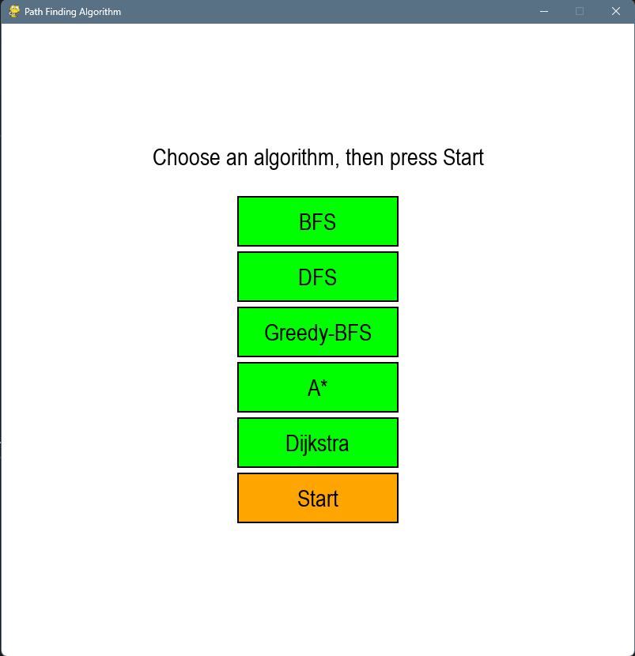
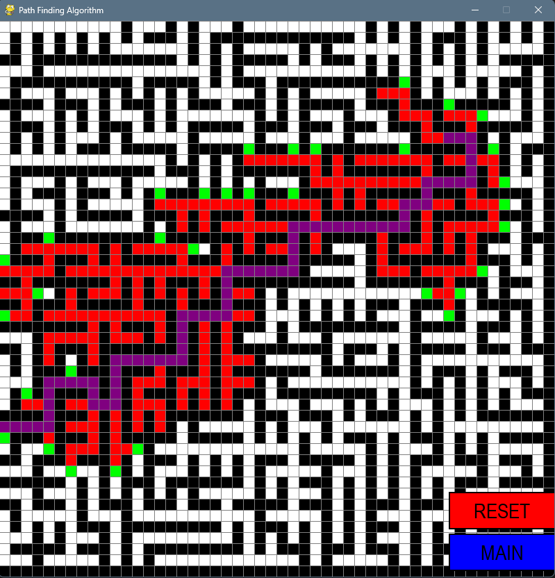

# Maze-Pathfinder

Welcome to Maze-Pathfinder, a fun and interactive Python application where you can experiment with various pathfinding algorithms to find your way through a maze!

Main Page

In-Game

## Table of Contents

1. [Introduction](#introduction)
2. [Features](#features)
3. [Installation](#installation)
4. [How to Use](#how-to-use)
5. [Contributing](#contributing)

## Introduction

Maze-Pathfinder is an application developed using Python's Pygame library. The purpose of this application is to visually demonstrate the workings of various pathfinding algorithms on a maze. Algorithms included in this project are Breadth-First Search (BFS), Depth-First Search (DFS), Greedy-Best-First-Search (GBFS), A* Search (A*) and Dijkstra's algorithm.

## Features

-   Interactive Graphical User Interface (GUI)
-   Five different pathfinding algorithms: BFS, DFS, GBFS, A\*, and Dijkstra's
-   A maze generation feature using Prim's algorithm
-   Option to reset and choose a different algorithm to run

## Installation

1. Ensure that you have Python 3.8 or higher installed on your system.
2. Clone the repository: `https://github.com/RayWangyangMa/Maze-Pathfinder`
3. Navigate into the project directory: `cd Maze-Pathfinder`

## How to Use

Run the main Python file: `python main.py`

Once the application starts, you'll see a selection menu with five buttons, each representing a different pathfinding algorithm. Select an algorithm and press the "Start" button. The application will generate a new maze and apply the selected algorithm to find a path from the start to the end node. After the algorithm completes, you can either reset the application or go back to the main menu to select another algorithm.

## Contributing

Feel free to contribute to this project by providing suggestions, reporting issues or submitting pull requests. Please refer to the CONTRIBUTING.md file for more details.

We hope you enjoy exploring and learning with Maze-Pathfinder!
